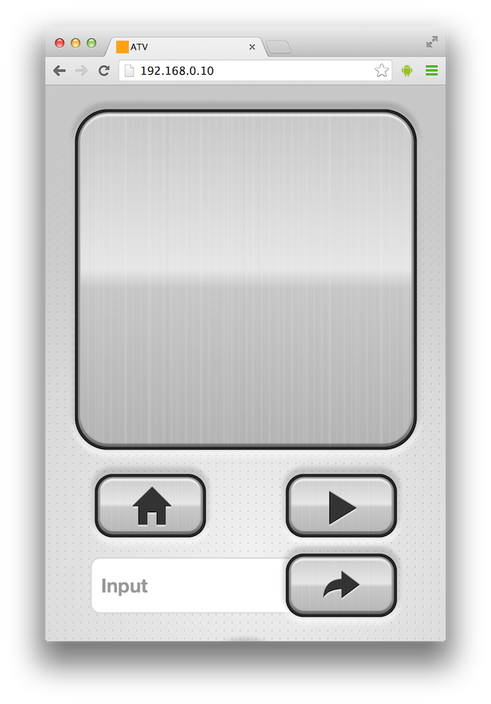
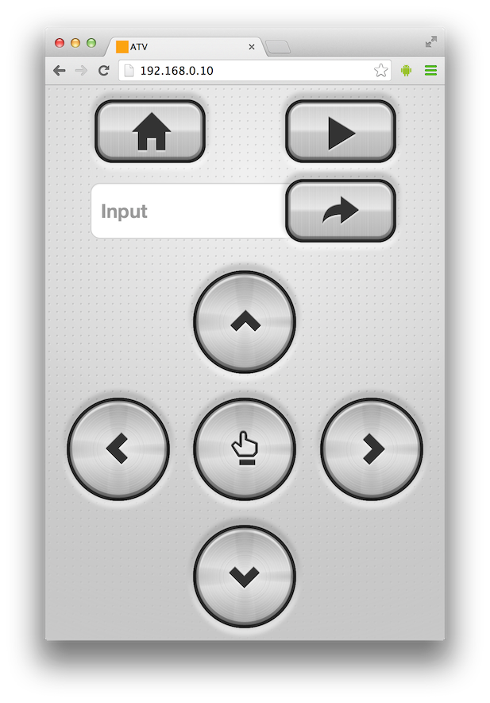
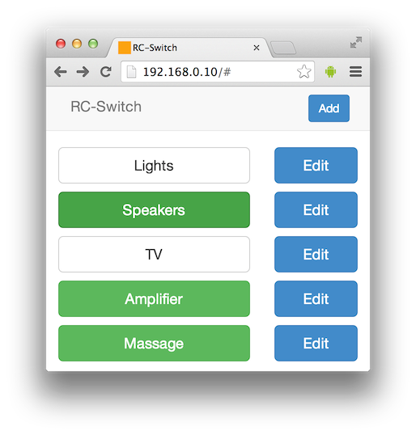

aWOT
==========

Collection of tools to build RESTful stuff with Arduino compatible boards. Only some of the features work on Arduino Uno. There is just not enough ROM and RAM.

It's a hack and under constant change. Prepare to get your hands dirty.

## WoT?

IoT, The Internet Of Things has been a buzzword for the past decade. While IoT focuses on getting devices connected to the global Internet and other existing networks with new novel communication medias and protocols Web Of Things, a sidekick of the IoT, is recycling the current web development patterns and tools to integrate everyday objects to the existing World Wide Web. In WoT the idea is to realize the IoT concept using the current web standards and practices. In order to do so WoT uses the REST architectural style implemented on top of the HTTP already in use all over the Internet.

The WoT concept can be taken a step further to allow the communications over other protocol stacks than the traditional TCP. By implementing the HTTP client and server components so that they don’t directly operate the underlying transport protocol but instead use an abstraction layer we are able to switch the whole protocol stack without making any changes to the actual software logic that is built on top of the components. A device designed to be controlled over Ethernet can be for example be managed over any number of compliant media such as Bluetooth , Wi-Fi, and serial port communications.

## Usage

```cpp
#include <SPI.h>
#include <Ethernet.h>
#include <HTTPServer.h>
#include <ServerInterface.h>
#include <EthernetServerAdapter.h>
#include <SerialServerAdapter.h>
#include <aJSON.h>
#include <aJsonStore.h>
#include <MemoryStore.h>

byte mac[] = { 0xDE, 0xAD, 0xBE, 0xEF, 0xFE, 0xED };
EthernetServer server(80);

// Server interface adapters
EthernetServerAdapter ethernetServerAdapter(&server);
SerialServerAdapter serialServerAdapter(&Serial);

HTTPServer webServer("");
MemoryStore memoryStore;

// Define a handler function
void getModel(HTTPServer &server, HTTPServer::MethodType type, char ** routeParams, char *, bool) {

  char * collentionName = routeParams[0];
  int modelId = atoi(routeParams[1]);

  aJsonObject* model = memoryStore.findModelFromCollection(collentionName, modelId);

  if(model){
    server.httpSuccess("application/json");
    aJsonStream serverStream(&server);
    aJson.print(model,&serverStream);
  }
  else{
    server.httpNotFound();
  }

}

void setup() {

  Ethernet.begin(mac);
  Serial.begin(9600);

  // Setup routing
  webServer.onGET("examples/:modelId", &getModel);

  // Populate dummy data
  memoryStore.createCollection("examples");

  for (int i = 0; i < 5; i++){ 
    memoryStore.saveModelToCollection("examples", aJson.parse("{\"test\":\"test\"}"));
  }

}

// Process incoming requests from serial and ethernet
void loop() {
  webServer.processConnection(&serialServerAdapter);
  webServer.processConnection(&ethernetServerAdapter);
}
```
## Performance

With Wiznet W5100 and Arduino Mega CRUD operations with memory store take ~100 ms and with Teensy 3.1 and W5200 ~40ms.  

## Integration testing

See QUnit example

## Demo Screenshots






## Links

http://hackaday.com/2014/04/14/fixing-apple-tvs-terrible-ui/

## Licence

Copyright (c) 2014, Lasse Lukkari 

Based on 

Webduino,
Copyright 2009-2014 Ben Combee, Ran Talbott, Christopher Lee, Martin Lormes
Francisco M Cuenca-Acuna

aJson,
Copyright (c) 2010, Interactive Matter, Marcus Nowotny
(Based on the cJSON Library, Copyright (C) 2009 Dave Gamble)

Permission is hereby granted, free of charge, to any person obtaining a copy
of this software and associated documentation files (the "Software"), to deal
in the Software without restriction, including without limitation the rights
to use, copy, modify, merge, publish, distribute, sublicense, and/or sell
copies of the Software, and to permit persons to whom the Software is
furnished to do so, subject to the following conditions:

The above copyright notice and this permission notice shall be included in
all copies or substantial portions of the Software.

THE SOFTWARE IS PROVIDED "AS IS", WITHOUT WARRANTY OF ANY KIND, EXPRESS OR
IMPLIED, INCLUDING BUT NOT LIMITED TO THE WARRANTIES OF MERCHANTABILITY,
FITNESS FOR A PARTICULAR PURPOSE AND NONINFRINGEMENT. IN NO EVENT SHALL THE
AUTHORS OR COPYRIGHT HOLDERS BE LIABLE FOR ANY CLAIM, DAMAGES OR OTHER
LIABILITY, WHETHER IN AN ACTION OF CONTRACT, TORT OR OTHERWISE, ARISING FROM,
OUT OF OR IN CONNECTION WITH THE SOFTWARE OR THE USE OR OTHER DEALINGS IN
THE SOFTWARE.
